# Arsenale

**Run a company of AI agents you can watch at work.**

Arsenale is a local dashboard and a small run log for AI assistants. Your
assistant (Claude Desktop, Claude Code, Cursor, VS Code, Codex, Gemini CLI,
Aider, your own scripts) logs what it starts, each step it takes, what it asks
you and what it delivers; the dashboard draws it live as an office floor, a
campus of offices, an org chart, an activity log, and the questions waiting
for you.

Since 1.0 it is also for people who are not developers: a first-start wizard
sets up offices from ready-made **office packs** (marketing, research,
operations, HR, finance, customer support, design), your assistant connects
through **MCP** and logs its work by itself, and you give it **tasks**, hire
and edit **team members** with a form, approve what it asks, and browse what
it **delivered**, in plain words.

It is named after the Arsenal of Venice, where specialist departments under
one management built ships in parallel, each at its own station, with the whole
yard visible from one place.

[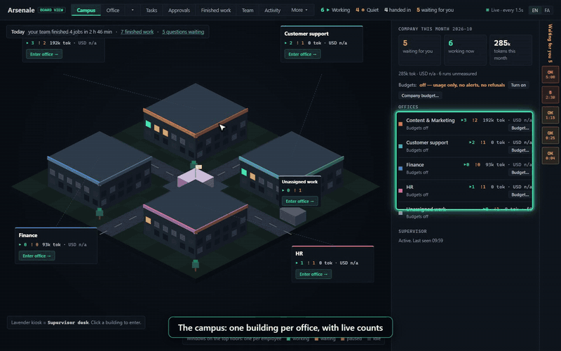](docs/media/arsenale-walkthrough.mp4)

[Watch the walkthrough](docs/media/arsenale-walkthrough.mp4) (about 2.5 minutes) (MP4, no sound; GitHub plays repository MP4 files when you open the link).

## Your AI team at a glance

You, your assistant, and the offices with the people who work in them:

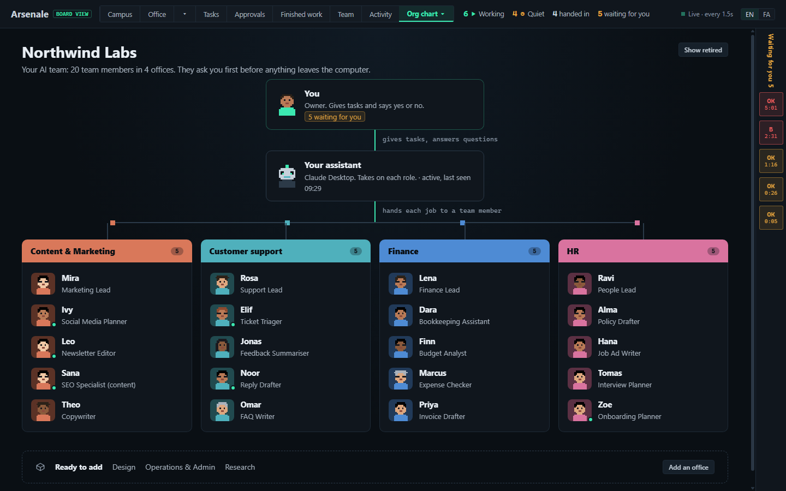

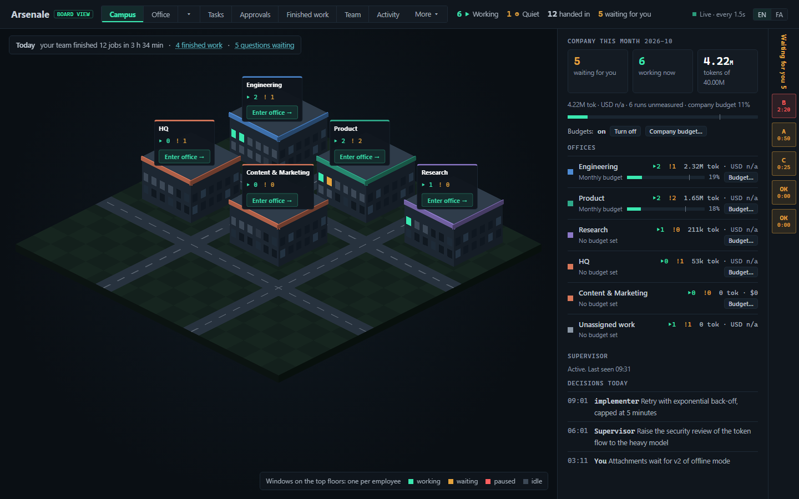

## What it is, and what it is not

- **It watches. It never runs agents.** Arsenale does not start, stop, pause
  or prompt an agent, and the server never starts a process. Your coding tool
  does the work; Arsenale shows it. (Tools like Paperclip launch and schedule
  agents themselves; Arsenale is deliberately the other half: the window.)
- **It works with any assistant.** The core is a library that writes JSON
  files, with three doors: the command line, an MCP server, and the page.
  Assistants that speak MCP log by themselves; others get a short block of
  instructions (or, for Claude Code, optional hooks). See [adapters/](adapters/).
- **It is local.** One folder of JSON files (`~/.arsenale`), a server on
  `127.0.0.1` only, no accounts, no telemetry, no dependencies beyond
  Node.js. It makes no network call at all unless you turn on a phone channel
  (experimental, below); then only to the service you chose.
- **A team member is a role, not a second AI.** In chat assistants such as
  Claude Desktop, a team member is a role brief your assistant reads (through
  MCP) and follows for one task, logging the job under that name. Only Claude
  Code can also run team members as separate sub-agents. Arsenale does not
  give you seven AIs working in parallel in one chat window.
- **It ships with an agent team** (`agents/`): 20 specialist agents
  (implementer, tester, code-reviewer, security-reviewer, ui-designer, …), an
  office lead with three heads (engineering, product, research), shared rules
  and a development cycle with three human gates. Use them, or bring your own;
  the dashboard draws whatever agents you have.

## Quick start

You need [Node.js](https://nodejs.org) 20 or newer and git.

```
git clone https://github.com/emadbarandan/Arsenale.git
cd Arsenale
node bin/arsenale.cjs demo
```

`demo` opens the dashboard on an invented company, in a temporary folder that
is deleted when you stop it with Ctrl+C. It never reads or writes your own data.
`demo --shop` shows the same company as a small shop with no developers: four
office packs, named team members, tasks, questions and finished work.

To install it for real, run the installer. It asks before every change outside
its own data folder; `--dry-run` shows the plan first.

| | Command |
|---|---|
| Windows (PowerShell 5.1 or 7) | `powershell -ExecutionPolicy Bypass -File .\install.ps1` |
| macOS, Linux, Git Bash | `./install.sh` |

The installer creates `~/.arsenale` with the `arsenale` command in its `bin`
folder, offers to put that folder on your PATH, and offers to set up each
coding tool it finds. Then:

```
arsenale serve            # http://localhost:4310, opens your browser with your key
arsenale serve --port 5000 --no-open
arsenale open             # open the running dashboard again (a new browser, cleared cookies)
```

### Per tool

| Tool | What to do |
|---|---|
| Claude Code | say yes when the installer asks: agents, `/feature` and `/fix` skills, a block in `CLAUDE.md`. Optional hooks: [adapters/claude-code](adapters/claude-code/) |
| Codex CLI | say yes: a block in `~/.codex/AGENTS.md`. [adapters/codex](adapters/codex/) |
| Gemini CLI | say yes: a block in `~/.gemini/GEMINI.md`. [adapters/gemini](adapters/gemini/) |
| Cursor | copy one rule file per repo. [adapters/cursor](adapters/cursor/) |
| Aider | log around the session from your shell. [adapters/aider](adapters/aider/) |
| Scripts, CI, anything | shell functions or plain JSON files. [adapters/generic](adapters/generic/) |

## Connect your assistant (MCP)

`arsenale mcp` is an MCP server on standard input and output, with no
dependencies. Open **Settings → Assistants** on the dashboard: each
client has a card with the exact command, link or snippet, shows it to you
before anything is written, and has a **Test** button that turns green when
your assistant says hello.

| Client | How | Status |
|---|---|---|
| Claude Desktop | adds `mcpServers.arsenale` to `claude_desktop_config.json` after you see the change; a backup is kept | supported |
| Claude Code | copy `claude mcp add --scope user arsenale -- <node> <arsenale>/bin/arsenale.cjs mcp` | supported |
| Cursor | an "Open in Cursor" link, or `~/.cursor/mcp.json` | experimental |
| VS Code (agent mode) | an "Open in VS Code" link, or the user `mcp.json` | experimental |
| Codex CLI | `codex mcp add …`, or `~/.codex/config.toml` | experimental |
| Gemini CLI | `~/.gemini/settings.json` | experimental |
| Other MCP clients | the command, or MCP over HTTP (below) | — |
| ChatGPT | not connectable: it needs a server on the public internet, and Arsenale stays on your computer | help wanted |

"Supported" and "experimental" are both untested against each client's current
release in this repository's CI; "experimental" means the snippet follows the
client's documentation and has not been tried by hand either. Use MCP or the
Claude Code `CLAUDE.md` block with hooks, not both: both log every job twice.

What the assistant can do through MCP: say hello, start a job, log a step,
finish with a plain summary, ask you a question, read your answers and its
inbox, read, create and update tasks, comment, register a deliverable, record
a decision, check an action against the safety rules, check a budget, read the
team and a member's brief, and propose a hire. What it cannot do, whatever it
is told: answer or approve questions, change budgets, pause anyone, hire,
install packs, change the safety rules or notification settings. Those have no
tool, and an argument such as `"by":"board"` is refused.

**MCP over HTTP** (optional, for clients that take only a URL): set
`ARSENALE_MCP_TOKEN` to a random value of 32 or more characters before
`arsenale serve`; the endpoint is `http://127.0.0.1:<port>/mcp`, needs
`Authorization: Bearer <token>` on every request, refuses other web pages'
Origins, and allows 20 calls a second. Without the variable it is off.

## How it works

```
 your coding tool                      Arsenale                         you
 ─────────────────                     ────────                         ───
 main session ──── arsenale start ───▶ ~/.arsenale/agent-runs/*.json
   └ sub-agent ─── arsenale progress ▶   (one file per run, gate,       ◀── browser:
   └ sub-agent ─── arsenale finish ──▶    decision; JSON, append-only)       http://localhost:4310
 main session ──── arsenale gate ────▶                                   │
 main session ◀─── arsenale answers ── answers.jsonl ◀── your answer ────┘ (two clicks)
```

1. The main session logs each run (`arsenale start`, then `finish`), the agent
   adds one progress line per step, and questions for you become gates.
2. `arsenale serve` reads the folder and serves the page. The page asks for
   changes every 1.5 seconds; while nothing changed on disk the answer is an
   empty `304`, so an idle tab costs almost nothing.
3. When you answer a gate on the page, the answer lands in `answers.jsonl`.
   The main session reads it with `arsenale answers` at its next turn. The page
   cannot reach your agents in any other way.

With Claude Code, the dashboard can also read each sub-agent's transcript
(only inside the folders you allow) to count its tool calls, files touched and
tokens.

## The screens

The 1.0 screens, from the shop demo (`arsenale demo --shop`; everything invented):


| | |
|---|---|
| 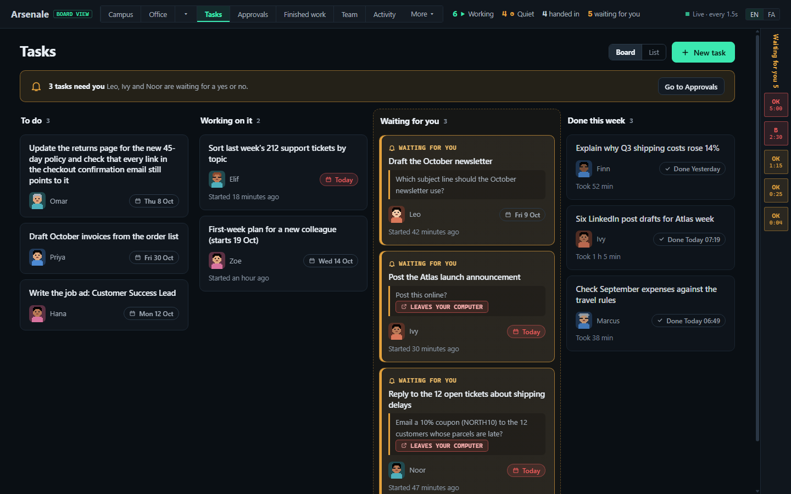 **Tasks**: a board of what you asked for (To do, Working on it, Waiting for you, Done this week), or a list. A question your team asks shows on its task. **New task** is a page of its own: what you need, who should do it, when, and whether you want to check it first. Writing a task starts nothing: your assistant picks it up the next time you talk to it. | 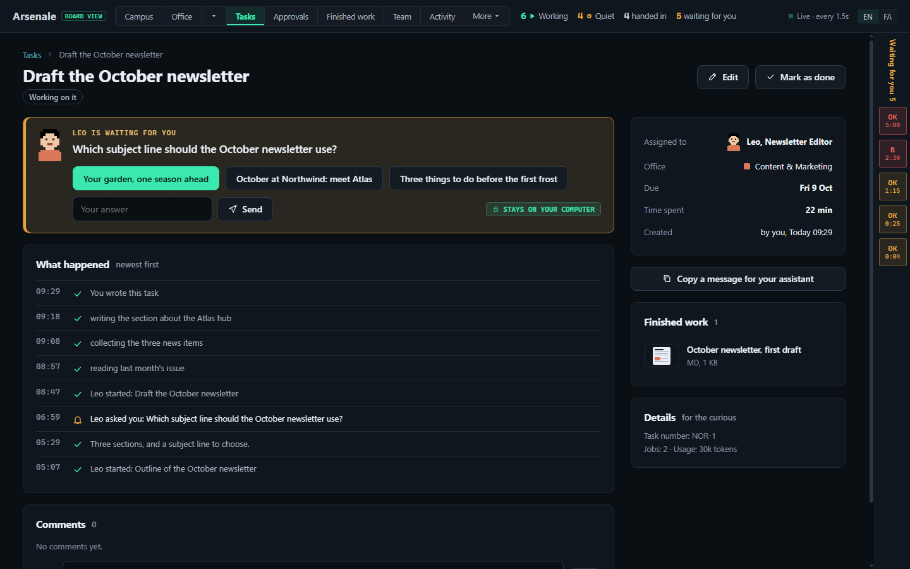 **A task**: the question waiting for you with its buttons, what happened (newest first), comments, the finished work, and the time spent; the task number and tokens only under Details. |
| 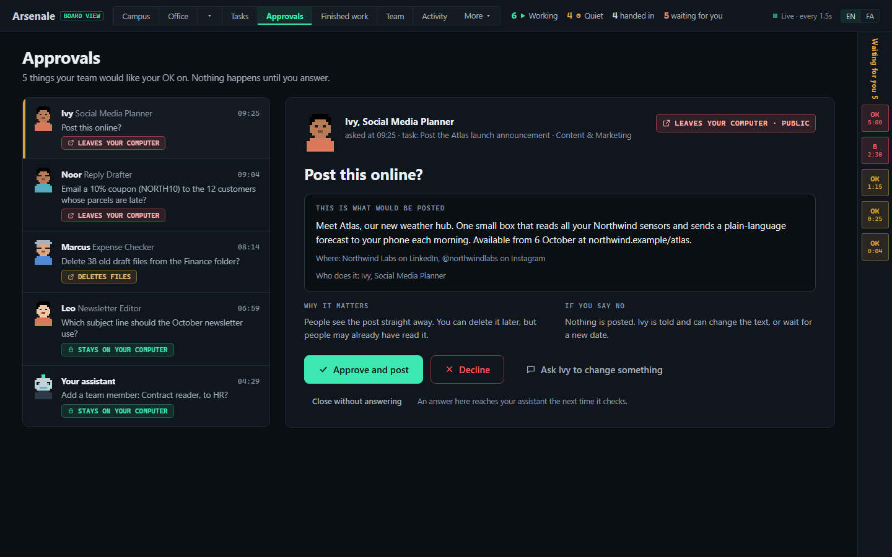 **Approvals**: one letter at a time: who asks, the question in plain words, what would happen, why it matters, what happens if you say no, and whether it leaves your computer. Two clicks to answer; or ask for a change. | 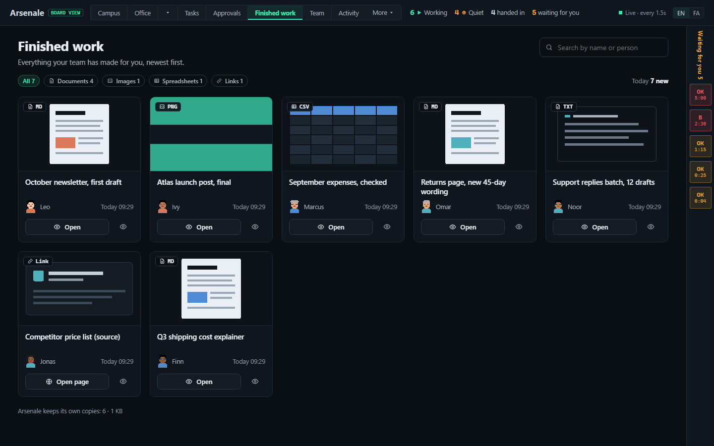 **Finished work**: documents, images, spreadsheets and links your team handed in, searchable by name or person, with previews from Arsenale's own copies. |
| 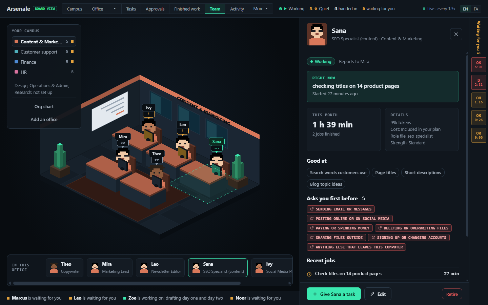 **Team**: each office as a room, with a desk, a name and a status bubble for every member; the profile opens at the side (right now, this month, good at, asks you first before). | 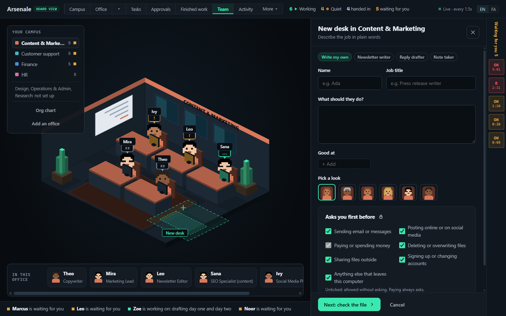 **New desk**: hire in plain words (name, job title, what they should do, good at, a look, what they ask first), then check the file before it is written; edits keep a backup. |
| 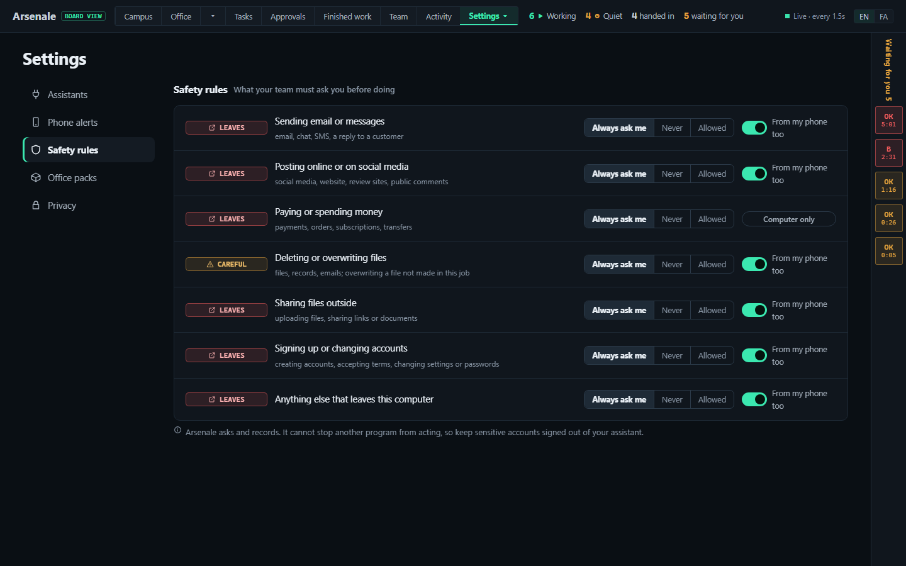 **Settings**: Assistants (connect in three steps), Phone alerts (with what your phone shows), Safety rules in plain words, Office packs, Privacy. | 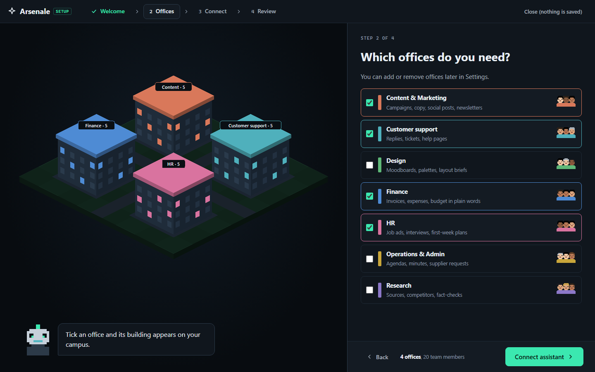 **First start**: four steps (welcome, offices, connect, review) while your campus builds itself on the left; nothing is saved before the last one. |

Persian: [approvals](docs/screenshots/approvals-fa.png), [tasks](docs/screenshots/tasks-fa.png), [team](docs/screenshots/team-profile-fa.png), [wizard](docs/screenshots/wizard-offices-fa.png).

The screens from before 1.0:

| | |
|---|---|
| 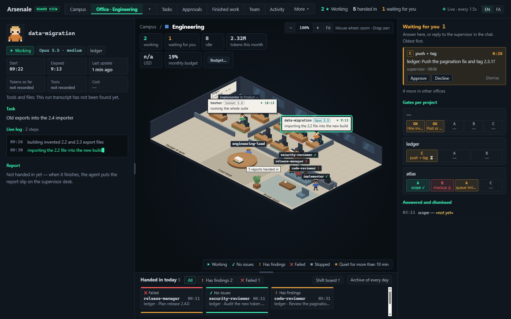 **Office**: one floor per office; agents at their desks with what they are doing now, reports landing on the lead's table, the shift board below. | 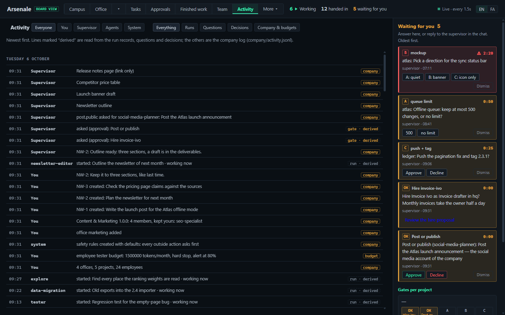 **Activity**: who did what and when, grouped by day, filterable; company changes from the log, everything else derived from the runs. |
|  **Campus**: one building per office, budgets and questions on the right. | 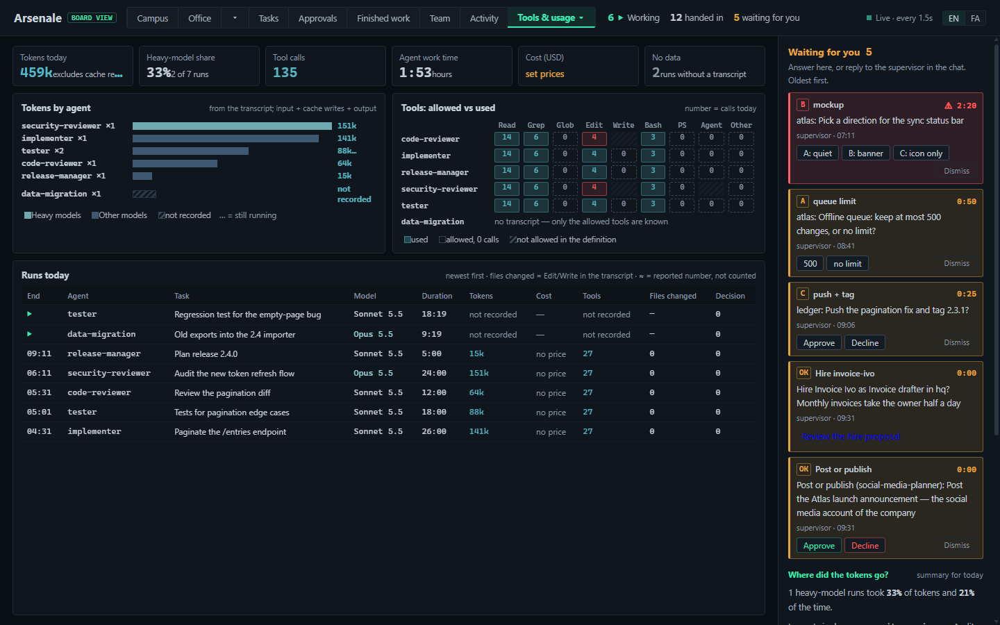 **Tools & usage**: tokens by agent, tools allowed against tools used, today's runs. |

Also: **Decisions & gates** (a timeline of who decided what), an **archive** of
every run, and an optional **Persian (FA)** interface
([screenshot](docs/screenshots/office-product-fa.png)).

### Desks

Every agent you have gets a desk, whatever it is called: the zone comes from a
`zone:` line in its definition (`build`, `review`, `docs`, `design`), else from
its name (`…-reviewer` reviews, `ui-…` designs, `…-docs` writes), else build.
A floor has 18 desks; more agents than that take a guest desk while they work.

## Office packs

Seven packs ship in `packs/`: Content & Marketing, Research, Operations &
Admin, HR, Finance, Customer support and Design, each with a lead and 3 to 4
members (33 in all). Every member prepares drafts and never sends, posts, pays,
orders or deletes by itself; HR and Finance members say that their output is a
draft for a qualified person, not legal, tax or employment advice.
Instructions are written for any assistant, with no tool or vendor names. The
pack texts have not yet been reviewed by an HR or finance professional.

Install and remove packs in **Settings → Office packs** (or pick them in the
wizard). Files go into Arsenale's own folder, `~/.arsenale/agents`; a member
whose name you already have is never overwritten (keep yours, or install a
copy); removing a pack deletes only the files you did not change and archives
the office, with all history kept. Only bundled packs install: a pack is
instructions a model follows, so packs from elsewhere are refused until packs
can be signed. The format is in [packs/README.md](packs/README.md).

## Safety rules

`~/.arsenale/policy.json` says, for each kind of action that leaves your
computer (send a message, post or publish, pay or buy, delete or overwrite,
share outside, change accounts, anything else), whether a team member may do
it, must **ask you first** (the default for all of them), or must never do it.
The assistant calls `check_action` (or `arsenale check-action`) first; "ask"
puts an approval on your dashboard.

This is advisory, and every screen says so: Arsenale asks your assistant to
check and records what happened, but it cannot block a tool inside another
program. To block an action for certain, also switch it off in your
assistant's own settings. Payments are never approved from a phone.

## Notifications

While the dashboard is open in a tab, your browser can notify you of a new
question, a task waiting for you, or a budget alert (Settings → Phone alerts;
on once you allow it in the browser).

**On your phone (experimental):** ntfy and Telegram can carry Approve /
Decline buttons, Pushover only notifies. They are off until you set them up and
a test arrived. By default a phone message says only "Arsenale: 1 question
waiting"; the question text and buttons need "details mode", which names the
service that will see the text. Each button carries an HMAC-signed, single-use
token that expires after 30 minutes and dies if the question changes. The
dashboard picks the tap up over its own outbound connection; no port is
opened. Secrets come only from environment variables, never from a file:
`ARSENALE_PHONE_KEY` (32+ characters, signs the buttons),
`ARSENALE_TELEGRAM_TOKEN`, `ARSENALE_NTFY_TOKEN` (optional),
`ARSENALE_PUSHOVER_TOKEN` and `ARSENALE_PUSHOVER_USER`. The channels have
been tested against their protocol in this repository, not yet on real phones.
Email is not built yet.

## Companies, offices and budgets (optional)

Without a company the dashboard is one office. With one, you get a campus of
offices, projects mapped to offices, an org chart, and monthly budgets. The
first-start wizard sets one up (it opens by itself on an empty data folder);
the command line can too:

```
arsenale log --company-init --seed company.example/seed.json
```

- Budgets count tokens (and USD when you fill in `model-prices.json` in the
  data folder; it ships empty, and a cost that cannot be priced shows "n/a",
  never 0). Company, office and employee budgets each have an alert threshold
  and an optional hard stop.
- **Budgets can be switched off** company-wide in one click: usage is still
  shown, without alerts or refusals.
- A hard stop is advisory: `arsenale budget-check` exits 2, and a supervisor
  that follows the rules asks you before starting the agent. Arsenale itself
  cannot stop a running agent.

## Commands

`arsenale --help` lists everything. In short:

| Command | Does |
|---|---|
| `arsenale serve [--port N] [--no-open]` | the dashboard (default port 4310) |
| `arsenale open [--port N] [--no-open]` | open the running dashboard with your key; `--no-open` only prints the address |
| `arsenale demo [--port N] [--no-open] [--shop]` | the dashboard on invented data (default port 4311); `--shop`: a small shop with office packs |
| `arsenale start / progress / finish / gate / decision --stdin` | log a run, a step, a result, a question, a decision |
| `arsenale answers` / `arsenale inbox` | what you answered or changed on the page |
| `arsenale mcp` | the MCP server on stdin/stdout, for an assistant to start |
| `arsenale task / comment --stdin` | create or move a task, comment on one |
| `arsenale deliverable --stdin` | register a link, a file (copied only from your deliverable folders) or text |
| `arsenale check-action --stdin` | ask the safety rules before an outside action (exit 0 allow, 2 never, 3 ask) |
| `arsenale log --help` | every logging mode, its JSON fields and exit codes |
| `arsenale paths` | where data, agents and transcripts are read |

Pass JSON with `--stdin` (a quoted heredoc in bash) or `--file`, never inline
when the text came from somewhere else:

```bash
arsenale progress --stdin <<'EOF'
{"id":"<run id>","doing":"reading src/app.ts"}
EOF
```

```powershell
Set-Content -Encoding UTF8 -Path "$env:TEMP\step.json" -Value '{"id":"<run id>","doing":"reading src/app.ts"}'
arsenale progress --file "$env:TEMP\step.json"
```

Exit codes: `0` done, `1` failed (bad input, unknown id, port taken), `2`
`budget-check` said stop or `check-action` said never, `3` `check-action`
said ask.

## Configuration

| Setting | Where | Default |
|---|---|---|
| Data folder | `ARSENALE_HOME` | `~/.arsenale` |
| Agent folders shown | `agentDirs` in `config.json`, or `ARSENALE_AGENT_DIRS` | `<data>/agents` (the installer sets your tool's folder) |
| Transcript folders that may be read | `transcriptRoots`, or `ARSENALE_TRANSCRIPT_ROOTS` | none |
| Heavy-tier model names | `heavyModels` | `["Opus"]` |
| Prices | `<data>/model-prices.json` | empty |
| Interface language | the EN / FA switch on the page | English |
| Folders deliverables may be copied from | `deliverableRoots` | `<data>/workspace` |
| Model per strength for hired members (Claude Code) | `tierModels` | `{"light":"haiku","standard":"sonnet","heavy":"opus"}` |
| MCP over HTTP | `ARSENALE_MCP_TOKEN` (environment only) | off |
| Phone channels | Settings → Phone alerts, secrets in environment variables | off |

Arsenale's own team-member folder, `<data>/agents`, is always read (last), so
hired and pack members show up even when `agentDirs` names other folders.

The language your agents and supervisor use with you is set in your tool's
instructions, not here: the bundled rules say "the user's language".

## Security model

- **One write library, three doors, the actor fixed by the door.** The page
  writes as you (the Board); the MCP server always as your assistant; the
  command line as whatever its JSON says. Owner-only work (answering,
  approving, budgets, pauses, hiring, packs, safety rules, notification
  settings) is refused in the library for every other actor, not hidden in the
  UI.
- The server listens on `127.0.0.1` only, and refuses any request whose Host
  header is not `localhost` or `127.0.0.1` on its port (no DNS rebinding).
- Every request needs your key cookie. `arsenale serve` makes a random launch
  key in `<data>/launch-key`, readable only by you, and opens the page with
  it once; the page trades it for a cookie and drops it from the address.
  Other accounts on the same machine can reach the port but not the key.
- Writes from the page also need the page's Origin and a token derived from
  the key; another web site can neither read the token nor send it. Bodies are
  capped at 8 KB (32 KB for tasks and the hire form) and validated.
- MCP over HTTP is off unless `ARSENALE_MCP_TOKEN` is set; then it needs that
  bearer token, refuses foreign Origins, is rate-limited and caps bodies.
- The hire form writes only into `<data>/agents` (another tool's file only
  after you confirm), generates the frontmatter itself so typed text cannot add
  keys, always appends the safety block, and backs up every edit.
- A deliverable path is copied into the store only from your deliverable
  folders, never a protected file (keys, `.env`, licences, `.ssh`), within
  type and size limits; images are checked by their first bytes, SVG and HTML
  are refused. Stored copies are served with `nosniff` and a sandbox CSP. A
  file is never opened or run; a path is shown as text.
- Connecting an assistant edits its settings file only after you saw the
  change, only that client's fixed file, never a file with comments, and keeps
  a backup next to it.
- Every response forbids framing (`X-Frame-Options: DENY`,
  `frame-ancestors 'none'`); the page's only allowed script is its own, by a
  nonce made fresh for each response.
- The server never runs a command and never starts a process. The launcher
  starts your browser, once, unless you pass `--no-open`; on Windows it also
  runs `icacls` once, when it makes the key file, to limit it to you.
- Transcripts are read only inside the folders you list. Secret-looking paths
  (`.env`, keys, licences) are counted, never shown.
- `"by":"board"` on the command line is a label, not authentication:
  anything that can run commands as you can act as you through the CLI. The
  MCP door does not accept it.
- The safety rules are advisory (above). An assistant manipulated by a web
  page or a document can write misleading logs or propose a harmful hire; it
  cannot approve anything, and you see a proposal in full before it is hired.

Report a vulnerability as described in [SECURITY.md](SECURITY.md).

## Uninstall

```
powershell -ExecutionPolicy Bypass -File .\install.ps1 -Uninstall      # Windows
./install.sh --uninstall                                                # macOS, Linux
```

It asks before removing the instruction blocks it added, the agent and skill
files it added (only those you have not edited; files it replaced are put
back from the backup), the launchers and the PATH entry. Your run logs stay in
`~/.arsenale` unless you add `-Purge` / `--purge`. Then delete the clone.

## Status

Version 1.0.0. There is no desktop app yet: Arsenale runs as `arsenale serve`
in your browser, so the installer still needs Node.js. Tested on Windows 11
with Node.js 24; the CI runs the test
suite on Windows, macOS and Ubuntu with Node.js 20, 22 and 24. The transcript
reading follows Claude Code's file layout as of this release and degrades to
"not recorded" if that layout changes.

## Contributing

Issues and pull requests are welcome; see [CONTRIBUTING.md](CONTRIBUTING.md),
which lists the areas where help is wanted (a desktop app, ChatGPT and other
clients that need a public server, a Claude Desktop Extension, email
notifications, checking the client matrix, signed third-party packs …).
Changes reach `main` only through a reviewed pull request.

## License

[MIT](LICENSE), copyright (c) 2026 Emad Barandan.
